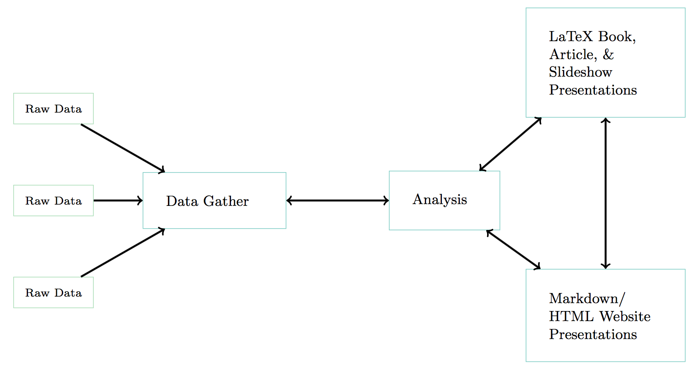

# Harvard DataFest 2017--Tools for Reproducible Data Science

Christopher Gandrud

Presents a reproducible research framework centered around RStudio/R Markdown.

The session assumes a basic familiarity with R (e.g. can install packages, source files, and so on).

## Checklist of skills you will learn

- [ ] Basic Markdown syntax

- [ ] Create a new R Markdown document that outputs to PDF and HTML

- [ ] Insert R code chunks into R Markdown documents that gathers data and outputs results

- [ ] Understand key code chunk option syntax

## What you need

- Installed:

    + R and RStudio

    + GitHub Desktop/GitHub account

    + LaTeX (if you want to output to PDFs)

- Working internet connection

## Motivation

- What is reproducible research?

- What are literate programming? How does it enhance reproducible research?

## A reproducible workflow in R

## File organisation

## Creating a new R Markdown File

- YAML

## Markdown Syntax

## RMarkdown Syntax
