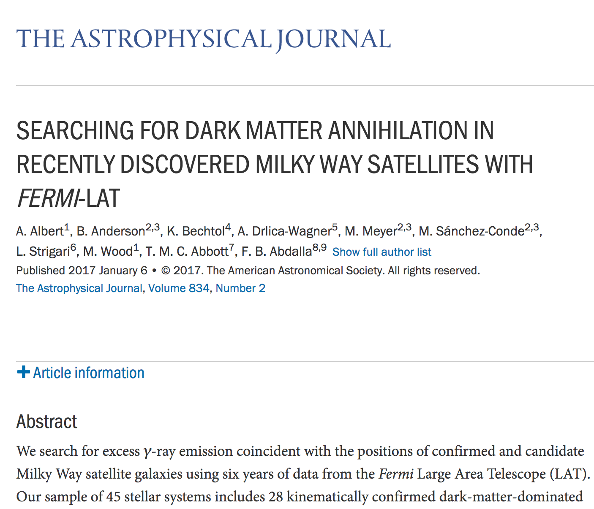

## Is this research?

## Is this research?

## No

> Papers, articles, slideshows, talks, books are **advertising, not research**.

## Skills checklist

- Reproducible research **workflow** with **literate programming**

- Create a new **R Markdown** document that outputs to PDF and HTML

- **Markdown** and **YAML** syntax

- Insert **R code chunks** into R Markdown documents that gathers data and outputs results

- Understand key **code chunk option** syntax

## Quants and computer programming

> The practice of quantitative science is computer programming.
