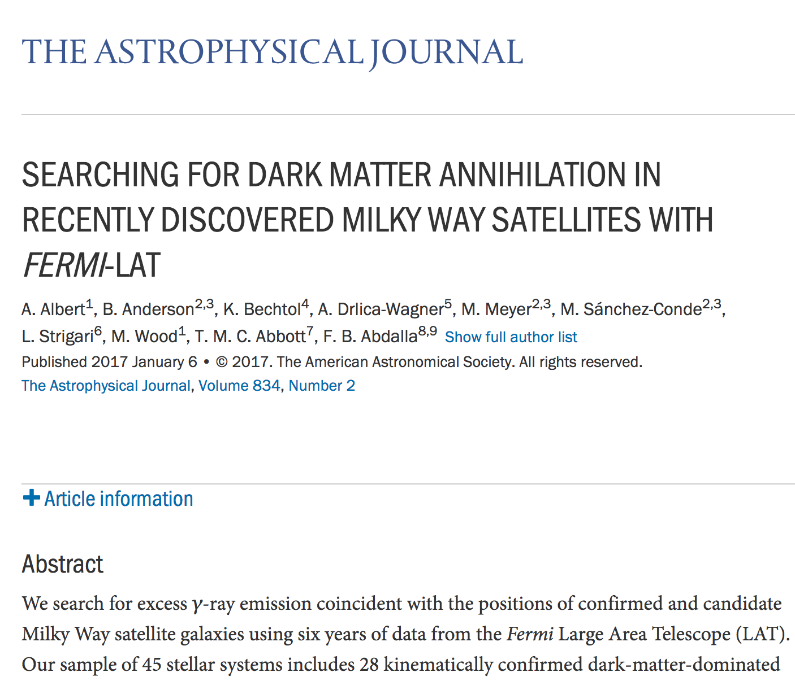
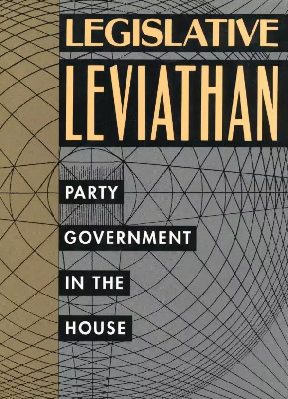
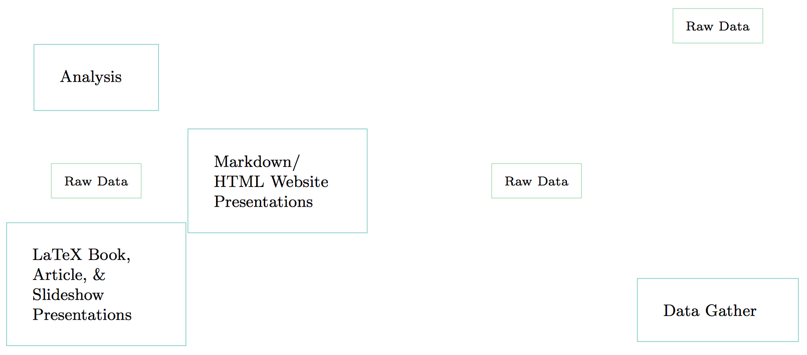
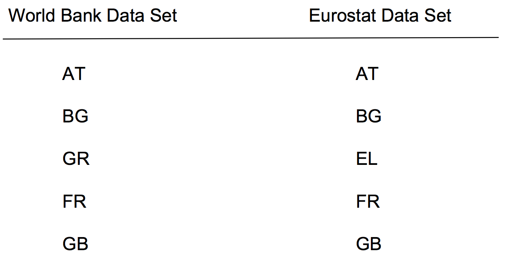
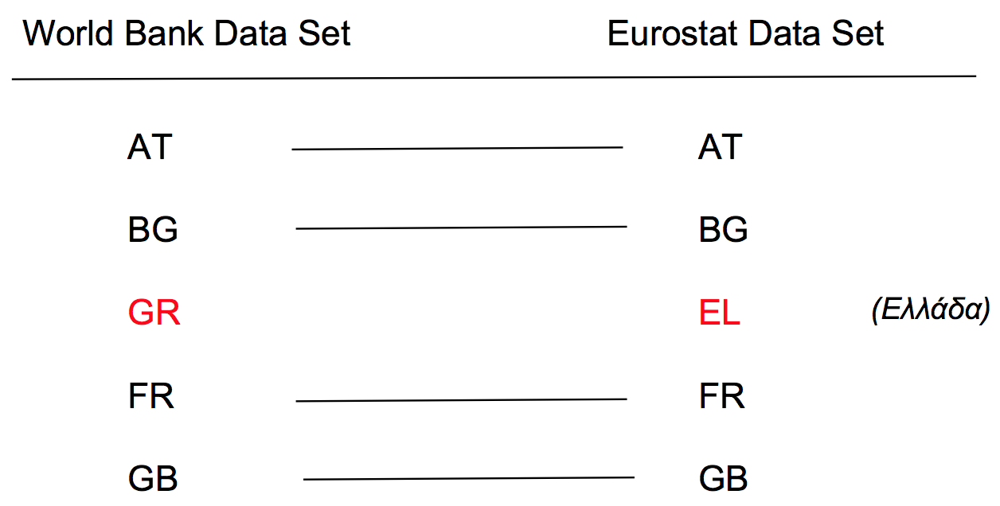

## Is this research?



## Is this research?



## No

> Papers, articles, slideshows, talks, books are **advertising, not research**.

## What are journal articles/books/etc?

> **Presentation documents**: announce select findings and try to convince an 
audience that they are correct [@Mesirov2010].

## What is research?

Quantitative research involves the **procedures** and **choices** researchers make to **gather** data, **process** it, and **analysis** it in order to address their research questions.

<br>
<br>

This includes “the **full software environment**, code, and data that produced the results” [@Donoho2010, 3015].

## Quants and computer programming {.build}

> The practice of quantitative science **is computer programming**.

<br>

So, we need **computer programming tools** (preview: literate programming). 

# Reproducible Comp. Research

## Replicable 

<br>
<br>
<br>

**Replicable research**: when there is sufficient information available for independent researchers to make the **same findings**, using the **same procedures** with ***new*** data.

## However . . .{.build}

Sometimes full replications are not feasible because:

- **limited resources** for gathering new data (e.g. very expensive to build
another Large Hadron Collider),
 
- the original research already sampled the **universe of cases**.

*So...*

## Reproducible

<br>
<br>
<br>

**Reproducible research**: when there is **sufficient information** available for independent researchers to make the same findings, using the same procedures with the **same data**.

## Sufficient info.?--unconnected files



## Sufficient info.?--dynamically linked files


## Linking with literate programming {.build}

Quantitative data science is the **creation of a computer programme** to gather, transform, analyse data and present the results.

<br>

**Literate programming paradigm**: the human-readable presentation of a programme is interspersed with computer source code that are compiled together [see @Knuth1992].

## Set of tools

<br>
<br>

- **Machine-readable source code**: R (alternatives: Python, Julia, etc.)

> - **Human-readable explanation**: a markup language like Markdown 
(alternatives: $\LaTeX$, HTML, etc.)

> - "**Tangled**" together with R Markdown

## Why reproducible research? {.build}

There are **costs** to using these tools. **Why** do it?

> Reproducibility is a **minimum** standard for evaluating scientific claims. 

## Mistakes

<br>
<br>

Reproducibility can help uncover research fabrication. But more commonly . . .

<br>

We **all make mistakes** during all stages of our research!

## A recent mistake {.build}

I wanted to merge fiscal policy data from two data sets using country IDs.



## A recent mistake

But, Eurostat uses slightly different country IDs.



## Correcting the mistake

Fortunately, I had documented all of my steps using literate programming and could quickly find and fix the problem.


## Correcting mistakes

<br>
<br>

**Instead of pretending** like mistakes don’t happen, we should have **procedures that help us minimise** our errors and allow us (and others) to **find and correct** the errors we do make.

<br>

Really reproducible research is an important part of this process.

## Important Caveat!

> “A study can be reproducible and still be wrong” [@Peng2014]. 
<br>
<br>
The original finding could just have been noise or caused by some data processing error and so on.

# Plan for learning tools

## Skills checklist

- Understand a reproducible research **workflow** with **literate programming**

> - Create a new **R Markdown** document that outputs to PDF and HTML

> - **Markdown** and **YAML** syntax

> - **R code chunks** into R Markdown documents that gathers data and outputs results

> - **Pandoc** citations

## Following along

In this workshop we will **create a fake research project** using the literate programming tool R Markdown.

<br>

A completed version of the project can be found at: <http://preview.tinyurl.com/hynlfxq>

## What you need

- Installed:

    + R and RStudio
    
    + `rmarkdown` package for R

    + GitHub Desktop/GitHub account

    + LaTeX (if you want to output to PDFs)

- Working internet connection


# Setup R Markdown File

## Create a new R Markdown file {.build}

In RStudio: `File` > `New File` > `R Markdown...`


## Save your file

<br>
<br>
<br>

Save your file as **main.Rmd** in a new folder called **datafest_reproduce**.


# YAML and Markdown Syntax

## The header

Your file should start with something like:

```{YAML}
---
title: "Example Project"
author: "YOUR NAME"
date: "07/01/2017"
output: pdf_document
---
```

This is the R Markdown file's **header**. 

## The header

An R Markdown file is just a text file with markup instructions that R (and RStudio) understand.

Header specifies document-consistent formatting

It is at the start of a file and comes between `---`.

The header is written in YAML.

## YAML

YAML is a **human read-able data format**.

**Elements** are **separated** from values with a **colon** (`:`).

**Each element** is separated by a **new line**.

**Hierarchy** is maintained with **tabs**.

## This presentation's header

```{YAML}
---
title: "DataFest 2017—Reproducible Research Tools"
author: "Christopher Gandrud -- IQSS"
date: "17 January 2017"
output: 
    ioslides_presentation:
        css: datafest_slides.css
        logo: img/iqss_logo_flat.png
bibliography: datafest_rep.bib
---
```

## In case you were wondering

<br>
<br>
<br>

YAML is a recursive acronym: ''YAML Ain't Markup Language''.

## Table of Contents & Numbered Sections

You can add a table of contents and numbered sections to your PDF output:

```{YAML}
output:
  pdf_document:
    toc: true
    number_sections: true
    fig_captions: true
```

To do the same for **HTML** also include the information under `html_document`.

## Figure Options

Create consistent figure formatting:

```{YAML}
output:
  pdf_document:
    fig_width: 7
    fig_height: 6
    fig_caption: true
```

`fig_caption: true` attaches captions to figures.

To set the actual caption label, use the `fig.cap='SOME CAPTION'` **code chunk
option**.


# R Code Chunks


# Pandoc Citations


## Resources {.build}

We only covered basic tools. Much more information is available at: <http://rmarkdown.rstudio.com/> and (shameless plug): 


## References
